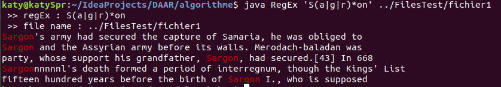

# Grep Clone

* Exemple d'utilisation

Dans l'exemple-1 on cherche une expression régulière dans un fichier.

Dans l'exemple 2 on cherche une expression régulière "hel" suivi d'un caractère et qui se trouve a la fin de la ligne dans un fichier.

Egrep implementé s'utilise de la manière suivante :

*Name: 
RegEx 

* Commande : 
java RegEx [ OPTIONS ] PATTERN [ FILE ]

* Description : 
Notre programme cherche dans l'entrée du nom FILE les lignes contenantes un match avec la PATTERN entrée. Par défaut, il va afficher les lignes correspondantes.

* Les options :
-h : N'affiche que les match trouvé
-l : Affiche le nom du fichier
-i : Ignore les distinctions de casse dans le PATTERN et le fichier d'entrée
-c : Supprime la sortie normale; à la place, imprime un nombre de mots correspondantes pour chaque fichier d'entrée. (nombre de mots trouvé)
-y : Supprime la sortie normale; à la place, imprime le nombre de ligne correspondantes pour chaque fichier d'entrée. (nombre de ligne où y a des match)
-m[n] : Arrête l'affichage des linge matchée à la n-ème ligne
-o : N'affiche que les match trouvé
-n : Affiche le numéro de ligne suivi de la sortie par défaut
-w : Sélectionne uniquement les lignes contenantes des correspondances qui forment des mots entiers.

* Caractère spécial accepté} :
^ : PATTERN recherchée est au début de la ligne.
$: PATTERN recherchée se trouve à la fin de la ligne.
*: L'élément précédent sera apparu zéro ou plusieurs fois.
|: L'élément précédent ou L'élément suivant de $\vert$ doit être présent.
( & ): L'opérateur qui suit ce caractère sera appliqué à tout ce qui a entre parentes.
?: L'élément précédent est facultatif et correspond au maximum une fois. (cependant la recherche avec ce caractère peut ne pas fonctionner, des erreurs sont malheureusement encore présentes)

* Expressions régulières basiques
Dans les expressions rationnelles de base, les méta-caractères  . , * , | , ( , ) et ? perdent leur signification particulière; utilisez plutôt les versions anti-slashées \. , \*, \| , \( , \) et \? ou utilisez le PATTERN avec `[PATTERN]`.
